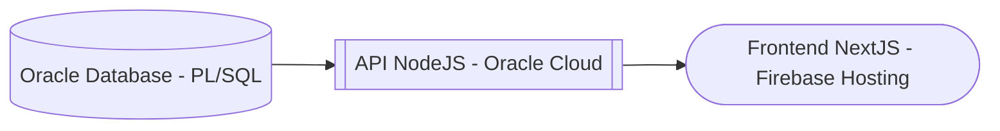

# BBDD_SQL-PLSQL

Repositorio que contiene la implementación completa de una **base de datos Oracle** integrada con un **backend Node.js** desplegado en **Oracle Cloud**, orientada a la gestión de ventas, control de operaciones y auditoría automática de procesos.

Incluye:

- Creación y modelado de tablas.
- Consultas SQL optimizadas.
- Funciones y procedimientos almacenados (PL/SQL).
- Triggers automáticos de auditoría y bitácora.
- Control de errores y registro histórico de eventos.
- Ejecución remota de paquetes PL/SQL mediante la API del backend.

---

## Repositorios Relacionados

- [Backend (Node.js + Oracle Cloud)](https://github.com/alex3373/Oracle_Gestion_API)
- [Frontend (Next.js + Firebase Hosting)](https://github.com/alex3373/Frontend_Gestion_BBDD)

---

## Modelo ER

Estructura general del modelo entidad-relación de la base de datos.

  

---

## Triggers de Bitácora

Ejemplo de trigger aplicado tras una operación **UPDATE**, registrando automáticamente los cambios en la tabla de bitácora y sincronizándose con el backend vía API Node.js.

  

**Endpoints relacionados:**  
`PUT https://api.0003333.xyz/api/vendedor/:rut/sueldo` – Actualiza el sueldo base de un vendedor, activando el trigger de auditoría en la base de datos.  
`GET https://api.0003333.xyz/api/bitacora` – Consulta los registros generados automáticamente por los triggers.

## Ejecución Remota de Procedimientos

Ejecución de un package PL/SQL y de procedimientos almacenados mediante peticiones al backend desplegado en Oracle Cloud.

  

**Endpoints relacionados:**  
`GET https://api.0003333.xyz/api/generar-informe/:anio`  
`GET https://api.0003333.xyz/api/porcentaje-vendedor`

---

## Control de Errores

Ejecución repetida del proceso en un mismo año genera detección automática de errores y registro en la tabla de auditoría.

  

**Endpoint relacionado:**  
`GET https://api.0003333.xyz/api/errores`

---

## Bitácora de Eventos

Todos los errores y operaciones relevantes quedan almacenados en la tabla de bitácora para seguimiento y depuración.

  

**Endpoint relacionado:**  
`GET https://api.0003333.xyz/api/bitacora`

---

## Integración Completa

El flujo de trabajo entre base de datos y backend permite:

- Registrar eventos automáticamente vía **triggers PL/SQL**.  
- Consultar y actualizar información mediante **API REST**.  
- Visualizar resultados y reportes a través del **frontend Next.js**.  

---

## Autor

**Alexis Córdova Díaz**  
Analista Programador | Desarrollador Full Stack  
📧 alexisandres311@gmail.com  
🌐 [linkedin.com/in/alexis-andres-cordova](https://linkedin.com/in/alexis-andres-cordova)

---
